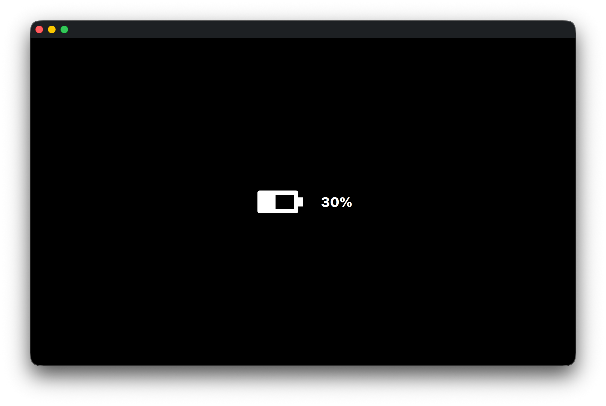

# BatteryIndicator
This BatteryIndicator Qt App demonstrates the the Model-View-Controller (MVC)
pattern using Qt 6, CMake, C++17, and QML. The BatteryModel is the model. The
QML is the view. And the BatteryController is the controller. This project
simulates a battery draining over time and shows how to connect C++ models to a
QML UI using Qt’s meta-object system.

## Overview
BatteryIndicator is a minimal Qt application that:
- Uses a BatteryModel as the data model (battery level state).
- Uses QML for the UI (view).
- Uses BatteryController for logic and timer updates (controller).
- Logs battery state changes in the UI.

## Key Concepts Demonstrated
- Qt signals & slots and timer-based updates
- Qt properties exposed to QML via Q_PROPERTY
- C++ and QML integration
- Qt 6 + CMake project structure
- Clean, readable and minimal-dependency code
- Use of Qt resource system (QRC) for assets
- Simple logging in the application

## How It Works (High Level)
1. BatteryController runs a QTimer every second.
2. On timeout, the timer emits the QTimer::timeout signal.
3. The QTimer::timeout has a custom signal slot that emits updateBatteryLevel.
4. MainWindow connects updateBatteryLevel signal to the model’s slot, OnUpdateBatteryLevel.
5. OnUpdateBatteryLevel triggers a batteryLevelChanged signal callback.
6. From there, the model updates its batteryLevel internally and emits a batteryLevelChanged signal.
7. The QML UI binds to batteryLevel and updates itself automatically whenever the batteryLevelChanged is emitted.

## Videos
<video width="640" height="480" controls>
  <source src="videos/BatteryIndicator.mov" type="video/mp4">
</video>

Note, if you cloned this repo, you can watch the video while previewing this
README. However, this video won't show on Github. So you can either check out
the demo in the videos folder or view the screenshot of the app here.



## Build requirements
- **Qt 6.x**
- **CMake 3.16+**
- A C++17-compatible compiler

Tested with:
- macOS
- Qt 6.x


## Building the project
```bash
# From the project root directory, run:
cmake -S . -B build -G "Ninja"
ninja -C build
```
